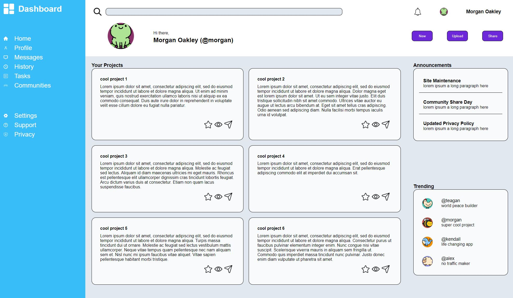

# admin-dashboard

[Live Demo](https://mrespicio.github.io/admin-dashboard/)

## Preview

## Project Goals
Put together an admin dashboard using CSS grid

## The Plan
This project challenges me focus on the page layout to create a successful admin dashboard design. I will first break up the page into the biggest sections to create the overall layout using grid. I will then be able to focus on each individual section one at a time to ensure responsiveness.

## Built With
### Technologies
* HTML
* CSS
### Tools
* Git and GitHub
* Visual Studio Code

## New Skills
* Understand using Google Chrome dev tools to help me visualize grids
* Responsive grids and grid nesting

## Reflection
Responsive design is something that I've struggled with before. The concept of grid itself wasn't too difficult for me to grasp, but learning about how to make a grid responsive opened up many more possibilities for me. Creating a responsive grid for this project was straightforward and I plan to utilize grid in future projects. 
Grid nesting also was extremely helpful. I was able to break up and tackle each section one by one without interfering with anotherm, especially in responsive design.

## Misc
This project was created as an assignment for [The Odin Project](https://www.theodinproject.com/lessons/node-path-intermediate-html-and-css-admin-dashboard)
Completed: July 2023